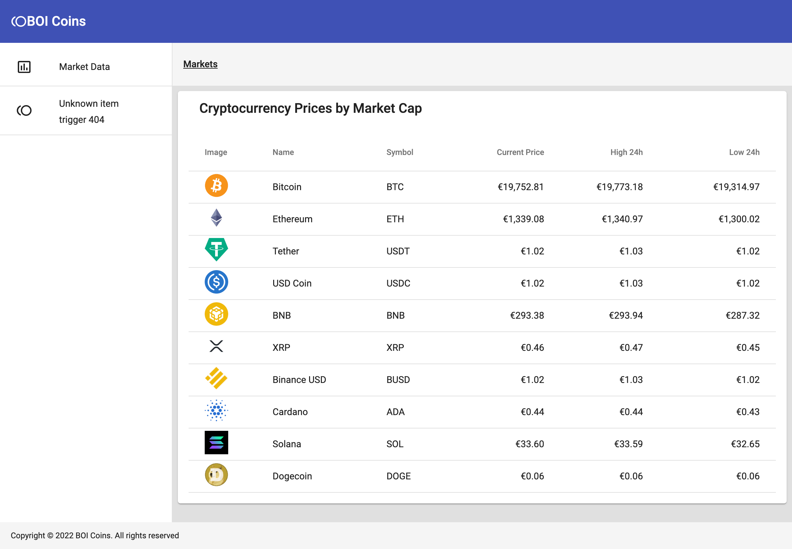
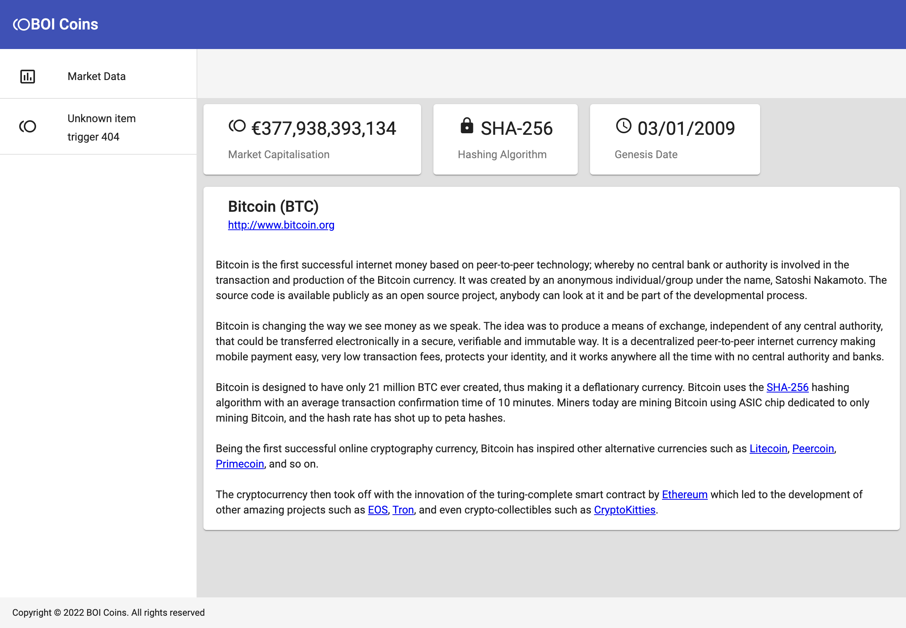
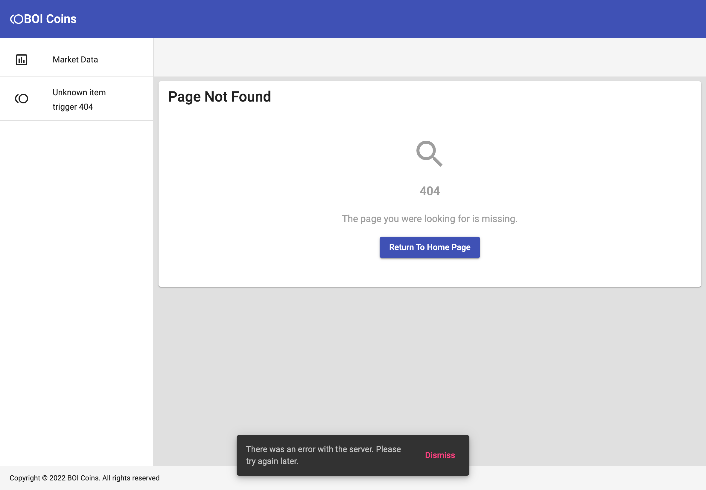

# BoiCoinGeko

## Getting Started

You need to have Node.js v16.10.0 or greater installed (you can do this simply by using [NVM](https://github.com/nvm-sh/nvm)).

From here install dependencies from the project root:

```bash
npm install
```

Once thats done you should be ready to run the app using:

```bash
npm start
```

The application is available at: [http://localhost:4200/](http://localhost:4200/). If everything went right you should be greated with the following:



Clicking on a table row will bring you to the coin details page:



If a coin is missing you will be shown a 404 page:


## Running unit tests

Run `yarn test` to execute the unit tests via [Karma](https://karma-runner.github.io).

## Issues Encountered

- The Coingecko API uses snake_case. I would normally add some middleware or object mappers in the api layer to rename keys to use camelCase. This stops the api from poluting the application. It also helps if the backend renames keys.

- The API doesnt return the number of pages available when doing pagination. This causes issues for the display of data on the frontend. One solution is to load all of the pages in the background and handle pagination properly in the frontend. First draft of this had pagination. I removed it for brevity.

- Testing isn't comprehensive in the app. I left the UI components untested, only plain TS/JS services were unit tested. Normally I would use Jest as the test framework. This allows for using snapshot tests for the UI components which is much more effecient. I would also have visual regression tests in place to handle styling and layout testing of the components.

- To keep third party libs to a minimum I didn't use ngrx (angular redux). This would be my preferred approach to tackling projects. I also didnt hook in many of the test libraries (data generators, jest, visual regression, etc.).

- The coin api returns descriptions with `\r\n\r\n` as well as dom nodes. To get this to render properly you need add the following to the dom node holding the description:

  ```html
  style="white-space: pre-wrap"
  ```

## Notes On Development

- Main toolbar would hold actions for global parts of the application (user accounts, global search, etc).

- Secondary toolbar holds topical data (current path using breadcrumb, any actions specific to the page, etc).

- The breadcrumb component isnt fully functioning. It's in there to fill out the UI. I do prefer to have this in a real application where there is hierarchy to the routes.

- The side nave would be the main navigation to parts of the application. Again more in there to give a bit of structure to the application.

- The application states have been cut down. Each component should really be a number of components depending on the state:
  - Not Asked (we haven't begun loading)
  - Loading (fetching/updating data in progress)
  - Error (there is an issue with the datasource)
  - Not Found (item not available 404)
  - No Data (no data available but 200 return, show user how to add data)
  - Data (display item as intended)
